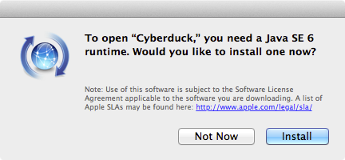

This is a Python script that uses the private SoftwareUpdate framework to download packages from Apple's Software Update servers using a predicate.

Predicates allow you to specify non-update packages you want to install. This mechanism is used e.g. by the Add Printer window to download a specific printer driver and the Speech prefpane to download voices for the language you selected. They write the predicate to a plist file (examples [1](docs/SUO1.plist) and [2](docs/SUO2.plist)) and call Software Update.app with the `-PredicateOptions` flag:

	/System/Library/CoreServices/Software Update.app/Contents/MacOS/Software Update -PredicateOptions /var/folders/zr/zr7jmShWFHKCpwZ-u+Y8rU+++X2/-Tmp-/SoftwareUpdateOptions.plist

This shows a window like this one:

In Mac OS X 10.6 Snow Leopard, the command line equivalent /usr/sbin/softwareupdate used to have an option `--predicate` that mimicked this behavior:

	sudo softwareupdate --predicate ~/Desktop/SoftwareUpdateOptions.plist --list
	sudo softwareupdate --predicate ~/Desktop/SoftwareUpdateOptions.plist --install --all

In Mac OS X 10.8 Mountain Lion however, that flag no longer exists. This script is supposed to fill that void.

I have only tested this script on Mac OS X 10.8.3. It likely also works on 10.7 Mountain Lion, but probably not on any earlier versions.

Here is an example of how to call it:

	sudo python predicate_installer.py '"VOICEID:com.apple.speech.synthesis.voice.anna.premium_2" IN tags OR "VOICEID:com.apple.speech.synthesis.voice.steffi.premium_2" IN tags OR "VOICEID:com.apple.speech.synthesis.voice.yannick.premium_2" IN tags'

If you'd like to see what it outputs, have a look [here](docs/log.txt) (it follows /var/log/install.log to show you what it's doing). Don't worry if it pauses for a few seconds or minutes after outputting _Acquired Lock: 0, 3887, 0_: it's simply downloading the package and doesn't have any kind of progress indicator.

To figure out what predicate you need to install a certain printer driver, voice, Java installer, etc., simply trigger the install in the GUI (i.e. select the driver in the Add Printer window, choose the voice in the Speech prefpane or launch a Java app, ...) so you get a window like the one shown above and then open a Terminal to run

	ps axu | grep 'Software Update'

This will give you a line like 

	/System/Library/CoreServices/Software Update.app/Contents/MacOS/Software Update -PredicateOptions /var/folders/c2/6n0g8_9n0gxbj_xsdt1byn600000gp/T/SoftwareUpdateOptions.plist

In some cases, the window might not appear like the one shown above but rather as a sheet of the current window (Add Printer appears to be doing just that). In this case, have a look at /var/log/install.log where you can find lines like

	Mar 16 12:29:59 testclient.physcip.uni-stuttgart.de Software Update[4218]: SoftwareUpdate: Using predicate ("printing software" IN tags OR "printer update" IN tags) AND "MANUFACTURER:HP;MODEL:Color LaserJet CP4020-CP4520" IN tags
	Mar 16 12:29:59 testclient.physcip.uni-stuttgart.de Software Update[4218]: SoftwareUpdate: Using filter keys 041-9116

The plist file matches the ones linked above and contains a key `predicate`.

Note that some installers require certain environment variables to be set even when using a predicate. For example, Java needs JAVA_INSTALL_ON_DEMAND. For details, see the [examples](examples).